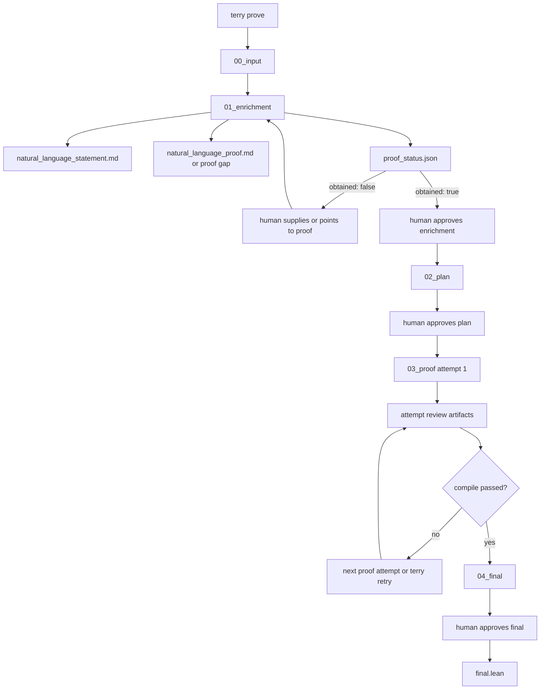

# Agent-Assisted Lean Formalization Engine

This repo builds a CLI-first workflow for taking a theorem source and turning it into
compiling Lean 4 code. The human surface is `terry`: start a run with `terry prove`,
inspect the checkpoint files Terry writes into `artifacts/runs/<run_id>/`, edit the
review file for the active checkpoint, and continue with `terry resume`.

## Current Shape

- `src/lean_formalization_engine/` holds the engine, CLI, template resolver, and Lean runner.
- `examples/` holds theorem inputs plus runnable demo scripts for the demo, command, and Codex backends.
- `examples/inputs/convergent_sequence_bounded.md` plus `artifacts/runs/convergent-seq-bounded/` give the first checked-in nontrivial Terry/Codex example that actually needed repair attempts.
- `artifacts/runs/<run_id>/` is the system of record for each run: checkpoints, proof attempts, final artifacts, and logs.
- `lean_workspace_template/` is the Terry workspace scaffold. The CLI auto-discovers it at depth 1, initializes one with `lake new ... math` if none is present, and falls back to the packaged scaffold for the known mathlib revision-mismatch bootstrap failure.
- `.terry/lean_workspace/` is Terry's local compile cache. It stays out of Git, keeps the warmed `.lake` state between runs in the same repo, and gets rebuilt when the template or the actual toolchain behind `lake` changes.
- `docs/` holds the durable workflow contract, backlog, roadmap, and walkthroughs.

## Flow



## Install

1. Install Lean:
   `curl https://elan.lean-lang.org/elan-init.sh -sSf | sh -s -- -y`
2. Put Lean on `PATH`:
   `source "$HOME/.elan/env"`
3. Install Terry:
   `python3 -m pip install . --user`
4. Put the user-site scripts directory on `PATH` if needed:
   `export PATH="$(python3 -m site --user-base)/bin:$PATH"`

## Quick Start

Start a run:

```bash
terry prove examples/inputs/right_add_zero.md --run-id right-add-zero
```

If you want Terry to keep reusing the same warmed Lean cache while you run commands from
some other shell location, point it at the cache-owning project directory explicitly:

```bash
terry prove examples/inputs/right_add_zero.md \
  --run-id right-add-zero \
  --workdir /path/to/project
```

`--workdir` is an alias for `--repo-root`, and Terry accepts it either before or after
the subcommand. That directory owns all three local Terry surfaces:

- `artifacts/`
- `lean_workspace_template/`
- `.terry/lean_workspace/`

By default Terry uses the live `codex` backend, so a working `codex` CLI must be on
`PATH` unless you explicitly pick another backend. To drive Terry through an external
provider command instead, pass:

```bash
terry prove examples/inputs/right_add_zero.md \
  --run-id right-add-zero \
  --agent-backend command \
  --agent-command "python3 examples/providers/scripted_repair_provider.py"
```

Terry pauses at three human checkpoints:

1. enrichment approval: scope, proof provenance, and whether Terry has an existing natural-language proof
2. plan approval: mathematical meaning plus Lean theorem statement and proof plan grounded in that proof
3. final approval: the compiling Lean candidate

The first real Lean compile in a repo can still be slow because it establishes the
shared `.terry/lean_workspace/` cache and its `lake-manifest.json`. Later Terry runs in
that same repo reuse the warmed cache instead of starting from a fresh copied workspace
each time. Cold templates only skip `lake update` when their dependencies are purely
local path dependencies that Terry can verify on disk.

At each pause Terry writes:

- `checkpoint.md` with the files to inspect and the exact resume command
- `review.md` where the human writes the decision and notes

The enrichment stage is now proof-gated. Terry will not open the plan stage unless
`01_enrichment/proof_status.json` reports `obtained: true` and the backend also wrote
both `01_enrichment/natural_language_statement.md` and
`01_enrichment/natural_language_proof.md`. If the proof is missing, the enrichment
handoff should ask the human for it instead of inventing one.

After editing the review file, continue with:

```bash
terry resume right-add-zero
```

Use this if you want a quick summary of where a run stopped:

```bash
terry status right-add-zero
```

If you want Terry to regenerate the review artifacts for a completed proof attempt:

```bash
terry review right-add-zero --attempt 1
```

If the proof loop is blocked and you want to grant more attempt budget without editing
`03_proof/review.md` manually:

```bash
terry retry right-add-zero --attempts 1
```

If you resume or inspect a run from outside that same project directory, pass the same
workdir again so Terry lands on the same artifacts and cache:

```bash
terry resume right-add-zero --workdir /path/to/project
terry status right-add-zero --workdir /path/to/project
```

## Run Layout

Each run lives under `artifacts/runs/<run_id>/`:

- `00_input/` — original source text and provenance
- `01_enrichment/` — backend-owned enrichment handoff, natural-language statement/proof files, proof status, plus Terry's checkpoint files
- `02_plan/` — backend-owned merged meaning+plan handoff plus Terry's checkpoint files
- `03_proof/` — prove-and-repair attempts, backend-written Lean candidates, per-attempt `review/` artifacts, compile results, and proof-blocked handoff if needed
- `04_final/` — final candidate, final review files, and approved output
- `logs/` — readable `timeline.md` plus structured `workflow.jsonl`

## Docs

- `docs/manual-review-walkthrough.md` — literal CLI walkthrough
- `docs/architecture.md` — workflow, logger, checkpoints, and template handling
- `docs/backlog.md` — review-gated open tasks
- `docs/roadmap.md` — milestone status and dated activity log
