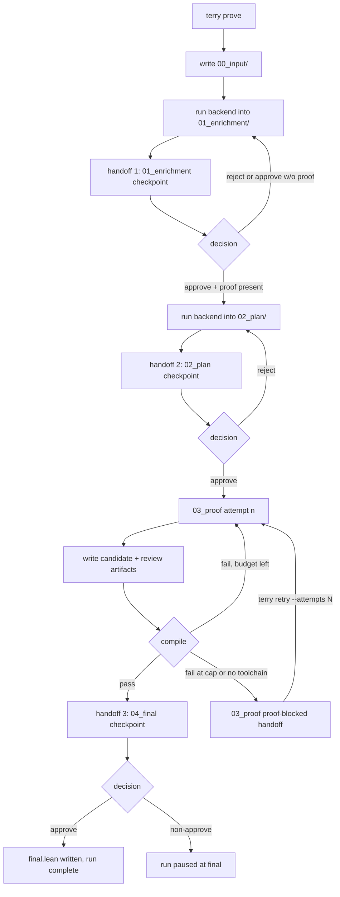

# Agent-Assisted Lean Formalization Engine

This repo builds a CLI-first workflow for taking a theorem source and turning it into
compiling Lean 4 code. The human surface is `terry`: start a run with `terry prove`,
inspect the checkpoint files Terry writes into `artifacts/runs/<run_id>/`, and
continue with `terry resume <run_id> --approve` when the handoff looks good. Only
edit the `review.md` file when you want to leave reviewer notes or reject the handoff.

## Current Shape

- `src/lean_formalization_engine/` holds the engine, CLI, template resolver, and Lean runner.
- `examples/` holds theorem inputs plus provider fixtures for command-backed Terry runs.
- `examples/inputs/convergent_sequence_bounded.md` plus `artifacts/runs/convergent-seq-bounded/` give the first checked-in nontrivial Terry/Codex example that actually needed repair attempts.
- `artifacts/runs/<run_id>/` is the system of record for each run: checkpoints, proof attempts, final artifacts, and logs.
- `lean_workspace_template/` is the Terry workspace scaffold. The CLI auto-discovers it at depth 1, initializes one with `lake new ... math` if none is present, and falls back to the packaged scaffold for the known mathlib revision-mismatch bootstrap failure.
- `.terry/lean_workspace/` is Terry's local compile cache. It stays out of Git, keeps the warmed `.lake` state between runs in the same repo, and gets rebuilt when the template or the actual toolchain behind `lake` changes.
- `docs/` holds the durable workflow contract, backlog, roadmap, and walkthroughs.

## Flow



## Install

1. Install Lean:
   `curl https://elan.lean-lang.org/elan-init.sh -sSf | sh -s -- -y`
2. Put Lean on `PATH`:
   `source "$HOME/.elan/env"`
3. Install Terry:
   `python3 -m pip install . --user`
4. Put the user-site scripts directory on `PATH` if needed:
   `export PATH="$(python3 -m site --user-base)/bin:$PATH"`

## Quick Start

Start a run:

```bash
terry prove examples/inputs/right_add_zero.md --run-id right-add-zero
```

If you want Terry to keep reusing the same warmed Lean cache while you run commands from
some other shell location, point it at the cache-owning project directory explicitly:

```bash
terry prove examples/inputs/right_add_zero.md \
  --run-id right-add-zero \
  --workdir /path/to/project
```

`--workdir` is an alias for `--repo-root`, and Terry accepts it either before or after
the subcommand. That directory owns all three local Terry surfaces:

- `artifacts/`
- `lean_workspace_template/`
- `.terry/lean_workspace/`

By default Terry uses the live `codex` backend, so a working `codex` CLI must be on
`PATH` unless you explicitly pick another backend. Terry also ships with a `claude`
backend that drives `claude -p --dangerously-skip-permissions`; select it with
`--agent-backend claude` (and optionally `--model <model>`). To drive Terry through an
external provider command instead, pass:

```bash
terry prove examples/inputs/right_add_zero.md \
  --run-id right-add-zero \
  --agent-backend command \
  --agent-command "python3 examples/providers/scripted_repair_provider.py"
```

Terry pauses at three human checkpoints:

1. `01_enrichment/checkpoint.md` + `01_enrichment/review.md`
2. `02_plan/checkpoint.md` + `02_plan/review.md`
3. `04_final/checkpoint.md` + `04_final/review.md`

The stage flow is now:

1. `terry prove` snapshots the original source file under `00_input/` and runs the backend into `01_enrichment/`. Terry does not normalize or ingest the theorem source itself anymore; the backend does that in enrichment. There is no separate statement-only checkpoint anymore; statement extraction and proof provenance are one combined enrichment handoff.
2. `01_enrichment/` must contain `handoff.md`, `natural_language_statement.md`, and `proof_status.json`, plus `natural_language_proof.md` whenever `proof_status.json` reports `obtained: true`.
3. If enrichment is accepted with a real proof on disk, Terry opens `02_plan/`.
4. `02_plan/` writes the merged meaning + Lean plan handoff.
5. If plan is accepted, Terry enters the bounded `03_proof/` prove-and-repair loop.
6. Each proof attempt writes `03_proof/attempts/attempt_<n>/candidate.lean`, Terry compiles it, and Terry/backend write `03_proof/attempts/attempt_<n>/review/walkthrough.md`, `03_proof/attempts/attempt_<n>/review/readable_candidate.lean`, and `03_proof/attempts/attempt_<n>/review/error.md`.
7. If an attempt compiles, Terry opens `04_final/`.
8. The final handoff shows `04_final/final_candidate.lean`, `04_final/compile_result.json`, and the latest attempt review artifacts.
9. If final is accepted, Terry writes `04_final/final.lean` and completes.

The first real Lean compile in a repo can still be slow because it establishes the
shared `.terry/lean_workspace/` cache and its `lake-manifest.json`. Later Terry runs in
that same repo reuse the warmed cache instead of starting from a fresh copied workspace
each time. Cold templates only skip `lake update` when their dependencies are purely
local path dependencies that Terry can verify on disk.

At each pause Terry writes:

- `checkpoint.md` with the files to inspect, the quick-approve command, and the exact resume command
- `review.md` where the human can leave reviewer notes or a rejection

When the handoff looks good and you have no notes, approve it in one step:

```bash
terry resume <run_id> --approve
```

`--approve` is equivalent to setting `decision: approve` with no notes in the current
stage's `review.md` and then running `terry resume`. Only edit `review.md` yourself
when you want to attach reviewer notes or reject the handoff; Terry assumes no
comments when you approve via the flag.

The exact branch behavior at each handoff is:

- `01_enrichment/`: `approve` with a proof present opens `02_plan/`. `approve` with the proof still missing reruns enrichment with notes from `01_enrichment/review.md` instead of entering plan. `reject` also reruns enrichment with those notes. `retry` is ignored here, and if `checkpoint.md` or `review.md` is missing, `terry resume` recreates the checkpoint and pauses again.
- `02_plan/`: the plan worker gets pointers to `01_enrichment/handoff.md`, `natural_language_statement.md`, `natural_language_proof.md`, `proof_status.json`, and enrichment review notes when they exist. `approve` enters the prove-and-repair loop. `reject` reruns plan with `02_plan/review.md` as notes. `retry` is ignored here too. Terry will not start plan unless the enrichment proof gate is satisfied, except for the explicit legacy pre-gate rerun compatibility path.
- `03_proof/`: each proof turn gets pointers to the enrichment files above, `02_plan/handoff.md`, plan review notes when present, the previous compile result, the previous candidate, and the previous attempt review artifacts (`previous_walkthrough`, `previous_readable_candidate`, `previous_error_report`) when they exist. Compile pass queues final review. Compile failure with budget left starts the next attempt automatically. Compile failure at the retry cap or because Lean/toolchain is unavailable opens the proof-blocked handoff. If attempt review generation failed on a prior attempt, `terry resume` regenerates the missing review artifacts before advancing. `terry review <run_id> --attempt n` only regenerates attempt review artifacts; it is not a human checkpoint.
- Proof-blocked handoff: this lives in `03_proof/` and is the only divergence that does not continue through `terry resume`. Terry writes `blocker.md`, `loop.md`, the latest compile result, and exposes `03_proof/review.md` for guidance. To continue, run `terry retry <run_id> --attempts N`. Terry then passes the notes in `03_proof/review.md` into the next proof turn.
- `04_final/`: `approve` writes `04_final/final.lean` and marks the run complete. Any non-approve decision leaves the run paused at final. There is no automatic final rerun branch because final is the terminal approval gate.

If you need to reject a handoff or leave notes, edit the stage's `review.md`
(change `decision: pending` to `approve` or `reject` and add notes) and then run:

```bash
terry resume right-add-zero
```

Use this if you want a quick summary of where a run stopped:

```bash
terry status right-add-zero
```

If you want Terry to regenerate the review artifacts for a completed proof attempt:

```bash
terry review right-add-zero --attempt 1
```

If the proof loop is blocked and you want to grant more attempt budget without editing
`03_proof/review.md` manually:

```bash
terry retry right-add-zero --attempts 1
```

If you resume or inspect a run from outside that same project directory, pass the same
workdir again so Terry lands on the same artifacts and cache:

```bash
terry resume right-add-zero --workdir /path/to/project
terry status right-add-zero --workdir /path/to/project
```

Long-running `terry prove`, `terry resume`, `terry review`, and `terry retry` commands
stream live workflow events to stderr while they run, and the same events are persisted
under `logs/timeline.md` and `logs/workflow.jsonl`.

## Run Layout

Each run lives under `artifacts/runs/<run_id>/`:

- `00_input/` — opaque source-file snapshot plus minimal source metadata
- `01_enrichment/` — backend-owned combined statement/proof-provenance handoff, `handoff.md`, `natural_language_statement.md`, `proof_status.json`, optional `natural_language_proof.md`, plus Terry's checkpoint files
- `02_plan/` — backend-owned merged meaning+Lean-plan handoff plus Terry's checkpoint files
- `03_proof/` — bounded prove-and-repair attempts, `attempt_<n>/candidate.lean`, per-attempt `review/` artifacts, compile results, and the proof-blocked handoff under `03_proof/` when Terry cannot continue automatically
- `04_final/` — final candidate, compile result, latest attempt review artifacts, Terry's final checkpoint files, and the approved `final.lean`
- `logs/` — readable `timeline.md` plus structured `workflow.jsonl`

## Docs

- `docs/manual-review-walkthrough.md` — literal CLI walkthrough
- `docs/architecture.md` — workflow, logger, checkpoints, and template handling
- `docs/backlog.md` — review-gated open tasks
- `docs/roadmap.md` — milestone status and dated activity log
