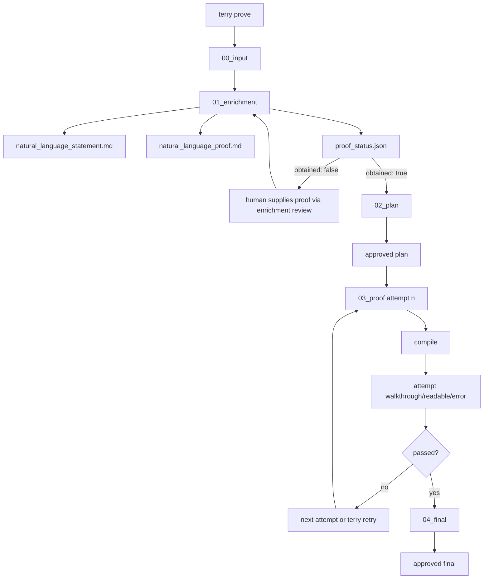

# Architecture

## Design Principles

- CLI-first: humans use `terry`, not Python approval helpers
- Three approval checkpoints: enrichment, merged plan, final
- Plan stage is proof-gated: Terry only plans once a natural-language proof is on disk
- Bounded prove-and-repair loop after plan approval
- Filesystem-first persistence: every checkpoint, attempt, and decision is on disk
- Readable logging: a human timeline plus a machine-readable event log

## Flow Figure



## Workflow Shape

Terry runs through five phases:

1. `00_input/`
   Normalized source text plus provenance
2. `01_enrichment/`
   Backend-owned enrichment artifacts plus Terry's checkpoint, review, and decision files.
  Terry expects `handoff.md`, `proof_status.json`, `natural_language_statement.md`,
  and, when the proof is available, `natural_language_proof.md`.
3. `02_plan/`
   Backend-owned plan artifacts plus Terry's checkpoint, review, and decision files
4. `03_proof/`
   The bounded prove-and-repair loop: backend-written Lean candidates, Terry compile
   checks, backend-written attempt review artifacts, persisted diagnostics, retry if needed
5. `04_final/`
   The compiling candidate, Terry's final review files, compile results, and the approved final Lean file

Terry no longer owns theorem extraction schemas, plan schemas, theorem parsing, or
provider-specific structured outputs. The chosen backend reads prior stage files and
writes its own `handoff.md` or `candidate.lean` files directly into the run directory.

The only human approvals Terry expects on the happy path are:

- enrichment approval
- plan approval
- final approval

Terry will not enter `02_plan/` unless the enrichment stage reports that a
natural-language proof was actually obtained. If the proof is missing, Terry stays at
the enrichment checkpoint and expects the backend to ask the human for that proof rather
than inventing one.

The proof loop can open one extra blocked handoff when it hits the retry cap or the Lean
toolchain is unavailable. That handoff lives under `03_proof/` and uses `decision: retry`
instead of `decision: approve`.

## Review Files

Each human checkpoint writes two files:

- `checkpoint.md`
  What to inspect, where to write the review, and the exact `terry resume <run_id>` command
- `review.md`
  Human-edited decision file

The review file is intentionally simple:

```text
decision: approve

Notes:
- review notes here
```

For proof-loop retries the decision is `retry` instead of `approve`.

`terry resume` parses `review.md`, records the result into `decision.json`, logs the
handoff, and continues only when the expected decision value is present.

Current CLI helpers on top of that review-file surface:

- `terry review <run_id> --attempt <n>`
  Regenerate the backend-owned attempt review artifacts for a completed proof attempt
- `terry retry <run_id>`
  Grant more proof attempts when Terry is blocked inside `03_proof/`

## Logging

Every run writes:

- `logs/workflow.jsonl`
  Structured event stream
- `logs/timeline.md`
  Human-readable chronological log

Events include:

- run start
- enrichment ready
- plan ready
- checkpoint open / approval
- proof loop start
- proof attempt start / failure / success
- proof blocked
- final candidate ready
- run completion

## Module Layout

- `src/lean_formalization_engine/cli.py`
  `terry prove`, `terry resume`, `terry review`, `terry retry`, and `terry status`
- `src/lean_formalization_engine/workflow.py`
  State machine, checkpoint writing, review parsing, stage-output validation, and prove-loop control
- `src/lean_formalization_engine/template_manager.py`
  Depth-1 template discovery and `lake new ... math` initialization
- `src/lean_formalization_engine/lean_runner.py`
  Shared local Lean workspace cache plus compile checks
- `src/lean_formalization_engine/storage.py`
  Run-store helpers and workflow logging
- `src/lean_formalization_engine/agents.py`
  File-first backend protocol
- `src/lean_formalization_engine/demo_agent.py`
  Deterministic baseline backend
- `src/lean_formalization_engine/subprocess_agent.py`
  External provider command backend that writes stage files directly
- `src/lean_formalization_engine/codex_agent.py`
  `codex exec` backend that writes stage files directly

## Backend Stage Calls

Each backend stage call gets a narrow control-plane payload:

- the stage name
- the repo-root-relative run directory and output directory
- repo-root-relative input file paths from earlier stages
- the current review-notes file path when the stage resumes after human input
- proof-loop attempt metadata and the latest compile-result path when Terry is asking for a repair

The backend is expected to write the required output file inside that output directory:

- `01_enrichment/handoff.md`
- `01_enrichment/natural_language_statement.md`
- `01_enrichment/proof_status.json`
- `02_plan/handoff.md`
- `03_proof/attempts/attempt_<n>/candidate.lean`
- `03_proof/attempts/attempt_<n>/walkthrough.md`
- `03_proof/attempts/attempt_<n>/readable_candidate.lean`
- `03_proof/attempts/attempt_<n>/error.md`

Terry persists the backend call beside those outputs as `request.json`, `prompt.md`, and
`response.txt`, but it does not parse theorem content back into Terry-owned schemas.

## Template Discovery

`terry prove` searches the Terry working directory at depth 1 for an eligible
`lean_workspace_template/` directory. A template is eligible when:

- it contains the Terry scaffold files (`FormalizationEngineWorkspace/Basic.lean` and `Generated.lean`)
- its Lean project includes `mathlib`

If none is found, Terry runs `lake new lean_workspace_template math` with a long timeout
and then overlays the shipped Terry workspace scaffold onto that new directory. If that
bootstrap fails with the known mathlib revision mismatch (`revision not found 'v4.29.1'`),
Terry falls back to the packaged workspace template, records the full `lake` stderr in
the structured workflow log, and continues. Other `lake new` failures still stop the run.

The CLI knob for that working directory is `--workdir` (alias `--repo-root`). Terry
accepts it before or after the subcommand, so `terry prove ... --workdir /path/to/repo`
and `terry --repo-root /path/to/repo prove ...` both target the same directory.

## Compile Cache

Terry compiles inside a shared repo-local workspace at `.terry/lean_workspace/`. That
directory is ignored by Git and persists across runs in the same repo, so the first real
`lake build` can warm `.lake` once and later Terry runs reuse it instead of cloning
mathlib into a fresh run-local copy every time.

If the shared workspace already has a `lake-manifest.json`, Terry treats that as the
successful external-dependency bootstrap point and reuses the warmed cache on later
runs. On a cold rebuild Terry only skips `lake update` when the template's dependencies
are purely local path dependencies that Terry can verify directly on disk; otherwise it
reruns `lake update` and records the new manifest before compiling.

Before each compile Terry overwrites only `FormalizationEngineWorkspace/Generated.lean`
and clears that module's old build outputs, which forces the current theorem to rebuild
while keeping the warmed dependency state. If `lean_workspace_template/`, vendored
`.lake/` contents inside that template, or the actual toolchain behind `lake` changes,
Terry rebuilds `.terry/lean_workspace/` before the next compile. If `lake update` fails
while creating that rebuilt workspace, Terry drops the partial manifest so the next run
retries the bootstrap instead of trusting a poisoned cache state.

## Backend Persistence

The run manifest now records:

- backend kind (`demo`, `command`, or `codex`)
- resolved subprocess command when Terry is using the command backend
- optional Codex model override
- template directory used for the run

That makes resumed runs backend-stable: `terry resume` rebuilds the agent from the
manifest instead of guessing from the current CLI flags.
